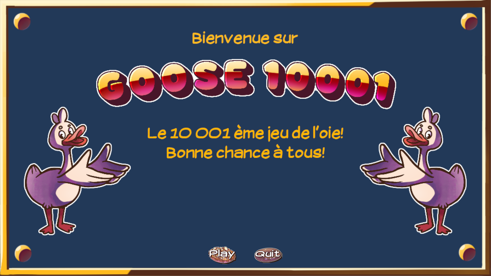
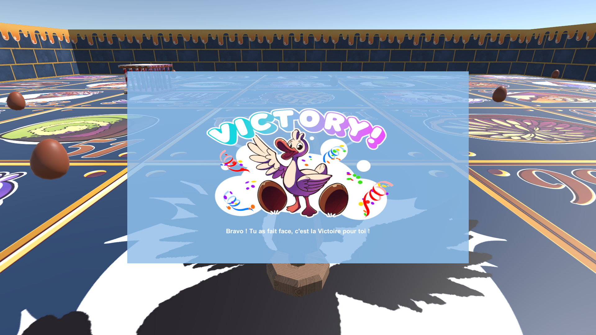
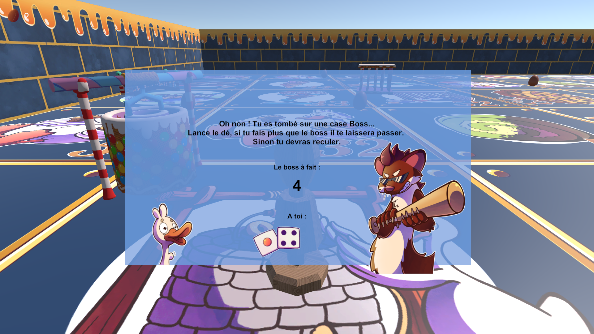
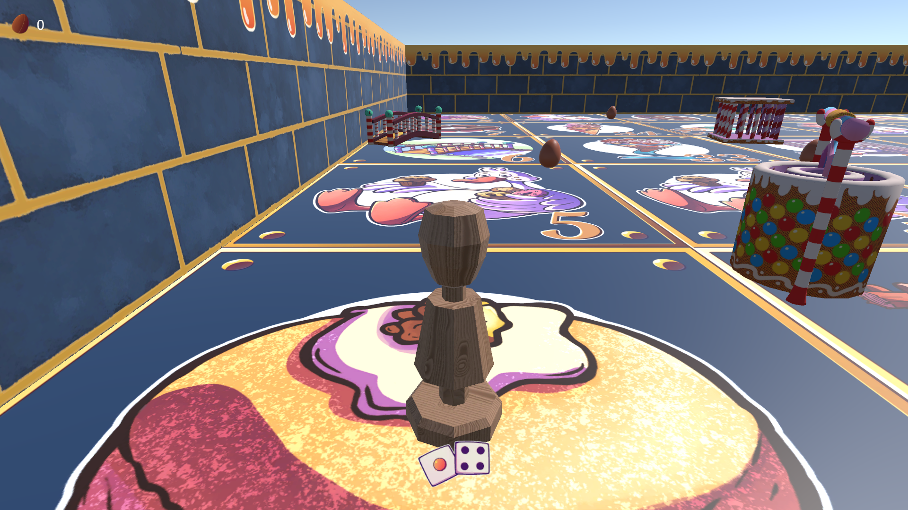

# Goose-10001

Goose 1001 est un jeu de l’oie comme on n’en a jamais vue ! Prenez le contrôle de votre pion en bois et prenez le risque de lancer le dé pour parcourir le plateau jonché de piège et de boss. Le dark souls des jeux de plateaux ! Ce jeu a été développé sous Unity par [4 étudiants infographiste](#a-propos). 

Starting Menu        |  Victory UI
:-------------------------:|:-------------------------:
    |  

Boss picture            |  Game picture
:-------------------------:|:-------------------------:
  |  

  
  

## A PROPOS
Le contexte du développement de Goose 10001.

Au cours de l'année universitaire 2022-2023, j'ai proposé à des étudiants le développement d'un petit jeu vidéo sous [Unity (2020.3.17f1)](https://unity.com/fr)  durant le **cours de Programmation** dans la **[formation Infographiste GAMAGORA](https://icom.univ-lyon2.fr/gamagora)**. Je les ai suivis et guidés au cours de ce développement, mais ce sont bien eux qui ont tout fait; notamment toutes les assets graphiques du jeu !  

 * BRUNEL David :
 * RAKOTONIAINA Andy :
 * REVOIL Justine : [LinkedIn](https://www.linkedin.com/in/justinerevoil)
 * VANZELLI Chloe : [ArteStation](https://www.artstation.com/bun-dmk)
